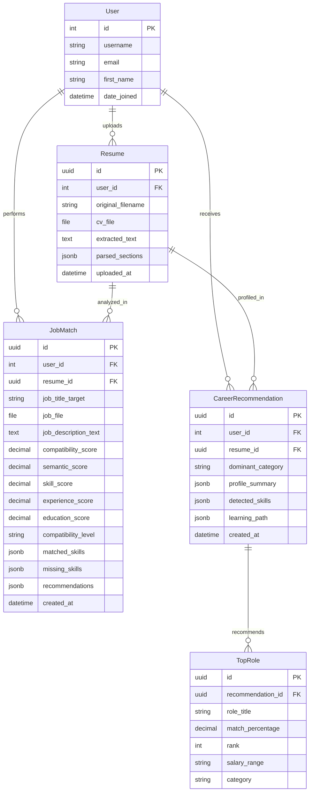

# Rancangan Skema Database (Django REST Framework & PostgreSQL)
**Proyek:** IT Career CV Analyzer & Matchmaking System  
**Backend Framework:** Django 5.x & Django REST Framework (DRF)  
**Database:** PostgreSQL  
**Backend Engineer:** Johannes Hutapea (Jojo)  

---

## 1. Entity Relationship Diagram (ERD) — Konseptual



---

## 2. Definisi Model Django ORM (`models.py`)
Model tabel di backend Python menggunakan Django ORM yang otomatis terhubung ke PostgreSQL:

```python
# backend/analyzer/models.py
import uuid
from django.db import models
from django.contrib.auth.models import User

class Resume(models.Model):
    id = models.UUIDField(primary_key=True, default=uuid.uuid4, editable=False)
    user = models.ForeignKey(User, on_delete=models.SET_NULL, null=True, blank=True, related_name='resumes')
    original_filename = models.CharField(max_length=255)
    cv_file = models.FileField(upload_to='resumes_pdf/')
    extracted_text = models.TextField()
    parsed_sections = models.JSONField(default=dict, blank=True)
    uploaded_at = models.DateTimeField(auto_now_add=True)

    def __str__(self):
        return f"{self.original_filename} ({self.uploaded_at.strftime('%Y-%m-%d')})"

class JobMatch(models.Model):
    id = models.UUIDField(primary_key=True, default=uuid.uuid4, editable=False)
    user = models.ForeignKey(User, on_delete=models.CASCADE, null=True, blank=True, related_name='job_matches')
    resume = models.ForeignKey(Resume, on_delete=models.CASCADE, related_name='matches')
    job_title_target = models.CharField(max_length=255, blank=True, null=True)
    job_file = models.FileField(upload_to='job_requirements_pdf/', null=True, blank=True)
    job_description_text = models.TextField()
    
    # Nilai Skor Kompatibilitas
    compatibility_score = models.DecimalField(max_digits=5, decimal_places=2) # e.g. 86.88
    semantic_score = models.DecimalField(max_digits=5, decimal_places=2)      # e.g. 74.83
    skill_score = models.DecimalField(max_digits=5, decimal_places=2)         # e.g. 86.67
    experience_score = models.DecimalField(max_digits=5, decimal_places=2)    # e.g. 100.00
    education_score = models.DecimalField(max_digits=5, decimal_places=2)     # e.g. 90.00
    compatibility_level = models.CharField(max_length=50)                     # HIGH, MEDIUM, LOW
    
    # Detail Hasil Ekstraksi
    matched_skills = models.JSONField(default=list)
    missing_skills = models.JSONField(default=list)
    recommendations = models.JSONField(default=list)
    created_at = models.DateTimeField(auto_now_add=True)

    def __str__(self):
        return f"Match {self.compatibility_score}% - {self.resume.original_filename}"

class CareerRecommendation(models.Model):
    id = models.UUIDField(primary_key=True, default=uuid.uuid4, editable=False)
    user = models.ForeignKey(User, on_delete=models.CASCADE, null=True, blank=True, related_name='recommendations')
    resume = models.ForeignKey(Resume, on_delete=models.CASCADE, related_name='career_profiles')
    dominant_category = models.CharField(max_length=100)
    profile_summary = models.JSONField(default=dict)
    detected_skills = models.JSONField(default=dict)
    learning_path = models.JSONField(default=dict)
    created_at = models.DateTimeField(auto_now_add=True)

    def __str__(self):
        return f"Career Blueprint - {self.dominant_category} ({self.created_at.strftime('%Y-%m-%d')})"

class TopRole(models.Model):
    id = models.UUIDField(primary_key=True, default=uuid.uuid4, editable=False)
    recommendation = models.ForeignKey(CareerRecommendation, on_delete=models.CASCADE, related_name='top_roles')
    role_title = models.CharField(max_length=255)
    match_percentage = models.DecimalField(max_digits=5, decimal_places=2)
    rank = models.PositiveSmallIntegerField() # 1, 2, atau 3
    salary_range = models.CharField(max_length=100, blank=True, null=True)
    category = models.CharField(max_length=100, blank=True, null=True)

    class Meta:
        ordering = ['rank']

    def __str__(self):
        return f"Rank {self.rank}: {self.role_title} ({self.match_percentage}%)"
```

---

## 3. Konfigurasi Database PostgreSQL di Django (`settings.py`)

```python
# settings.py
DATABASES = {
    'default': {
        'ENGINE': 'django.db.backends.postgresql',
        'NAME': 'it_career_db',
        'USER': 'postgres',
        'PASSWORD': 'your_password',
        'HOST': 'localhost',
        'PORT': '5432',
    }
}
```

---

## 4. Draf Interface Service Backend (Django REST Framework)

```python
# backend/analyzer/services.py
from typing import Dict, Any

class MatchingService:
    @staticmethod
    def process_match(cv_text: str, job_text: str) -> Dict[str, Any]:
        """
        Menjalankan pipeline Feature 1:
        1. SentenceTransformer all-MiniLM-L6-v2 (Cosine Similarity)
        2. Skill Jaccard Match & Rule-based Scoring
        """
        pass

class CareerRecommendationService:
    @staticmethod
    def generate_blueprint(cv_text: str) -> Dict[str, Any]:
        """
        Menjalankan pipeline Feature 2:
        1. Model job_role_classifier.joblib (TF-IDF + LogisticRegression)
        2. Lookup data pasar ke job_roles.csv
        """
        pass
