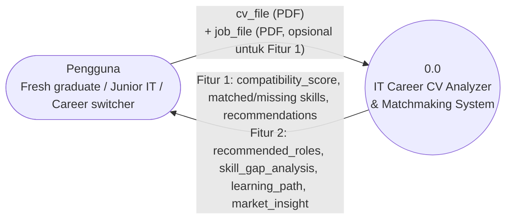
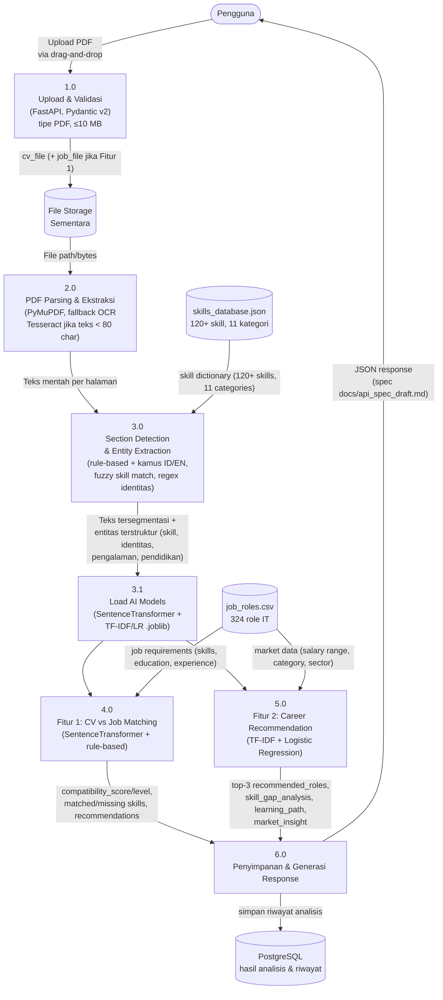

# Data Flow Diagram — IT Career CV Analyzer & Matchmaking System

Sistem bersifat **dual-mode**: Fitur 1 (CV vs Job Matching, top-down) dan Fitur 2 (Career Recommendation & Blueprint, bottom-up). Keduanya berbagi tahap parsing/ekstraksi yang sama sebelum bercabang ke pipeline AI masing-masing.

---

## DFD Level 0 (Context Diagram)

**Entitas luar:** Pengguna (mahasiswa akhir, fresh graduate, junior IT 0–3 tahun, career switcher)
**Sistem:** IT Career CV Analyzer & Matchmaking System
**Data masuk:** `cv_file` (PDF, wajib), `job_file` (PDF, hanya untuk Fitur 1)
**Data keluar:** hasil kompatibilitas CV↔lowongan (Fitur 1) *atau* blueprint karir & rekomendasi role (Fitur 2)

---

## DFD Level 1 (Rincian Proses Utama)

### Rincian tiap proses

**1.0 — Upload & Validasi**
- Endpoint: `POST /api/v1/match-job` (Fitur 1) atau `POST /api/v1/analyze-cv` (Fitur 2)
- Validasi: tipe file PDF, ukuran ≤ 10 MB (Pydantic v2), file disimpan sementara (*temp storage*)

**2.0 — PDF Parsing & Ekstraksi**
- `PyMuPDF` mengekstrak teks per halaman
- Fallback OCR (`Tesseract`) otomatis dipicu jika teks hasil ekstraksi < 80 karakter (indikasi PDF hasil scan/gambar)

**3.0 — Section Detection & Entity Extraction**
- Segmentasi teks ke 10 section (identitas, ringkasan, keterampilan, pengalaman, pendidikan, proyek, sertifikasi, dll.) berbasis kamus kata kunci Indonesia/Inggris
- Ekstraksi skill via *fuzzy matching* ke `skills_database.json`
- Ekstraksi entitas identitas (nama, email, phone, LinkedIn, GitHub, institusi, perusahaan, periode) via regex + heuristic

**3.1 — Load AI Models**
- Load `SentenceTransformer (all-MiniLM-L6-v2)` dari cache/local untuk embedding semantik
- Load `job_role_classifier.joblib` (TF-IDF Vectorizer + LogisticRegression) untuk klasifikasi role
- Model di-load sekali di *startup* (bukan per request) untuk performa optimal

**4.0 — Fitur 1: CV vs Job Matching** *(hanya jika `job_file` diunggah)*
- Encode CV & JD dengan `SentenceTransformer (all-MiniLM-L6-v2)` → cosine similarity (*semantic_score*)
- Hitung *skill Jaccard* (`skill_score`), *experience rule* (`experience_score`), *education rule* (`education_score`)
- *Weighted sum* → `compatibility_score` & `compatibility_level` (HIGH/MEDIUM/LOW)
- Output tambahan: `matched_skills`, `missing_skills`, `recommendations`

**5.0 — Fitur 2: Career Recommendation**
- `TF-IDF Vectorizer` (fit pada training set) → `LogisticRegression.predict_proba` atas 324 role IT
- Ambil Top-3 role dengan `match_score` tertinggi → lookup `job_roles.csv` untuk gaji & kategori (`market_insight`)
- *Feature importance* (bobot TF-IDF) → *AI reasoning keywords*
- `skill_gap_analysis` = required skills top-role − detected skills → `recommended_learning_path`

**6.0 — Penyimpanan & Generasi Response**
- Simpan riwayat analisis ke PostgreSQL (via SQLAlchemy)
- Susun response JSON sesuai `docs/api_spec_draft.md`, kembalikan ke client (frontend merender *score gauge*, *skill chips*, *radar chart*, *career blueprint* naratif)

### Data store

| Data Store | Isi |
|---|---|
| `skills_database.json` | 120+ skill dalam 11 kategori, dipakai untuk fuzzy skill matching |
| `job_roles.csv` | 324 role IT beserta skill, pendidikan, pengalaman, dan rentang gaji yang dibutuhkan |
| `job_role_classifier.joblib` | TF-IDF Vectorizer + LogisticRegression model (11MB) untuk klasifikasi role IT |
| `sentence_transformer_cache/` | Cached `all-MiniLM-L6-v2` model weights (384-dim embedding) |
| PostgreSQL (hasil analisis & riwayat) | Riwayat CV yang dianalisis per pengguna, skor, dan hasil blueprint karir |
| File storage sementara | File PDF CV/JD yang diunggah, disimpan sementara selama proses parsing |
